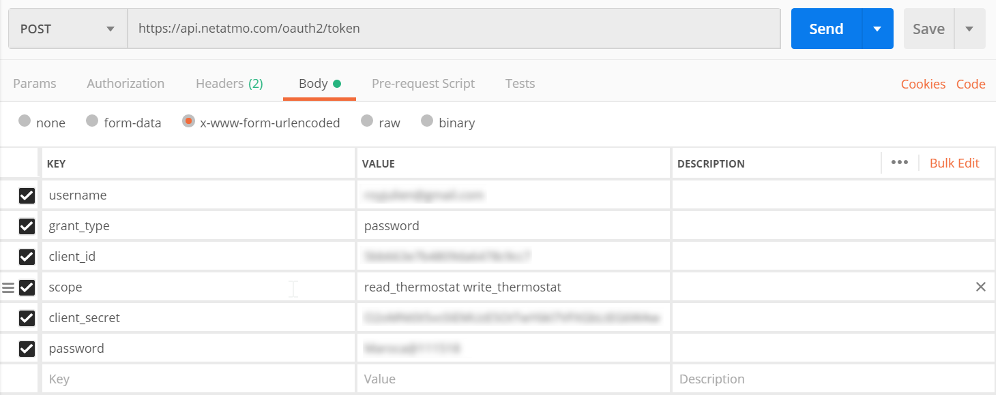
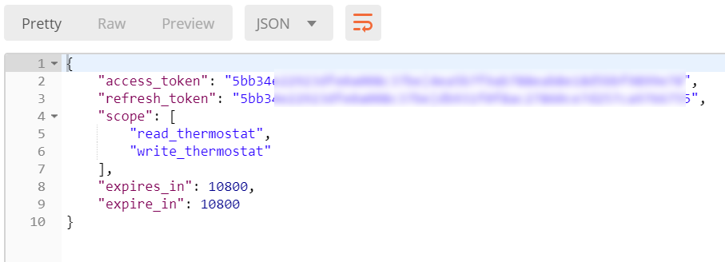
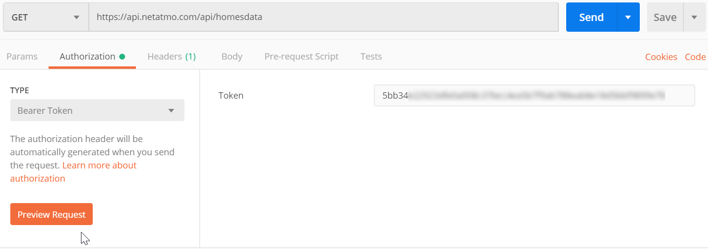
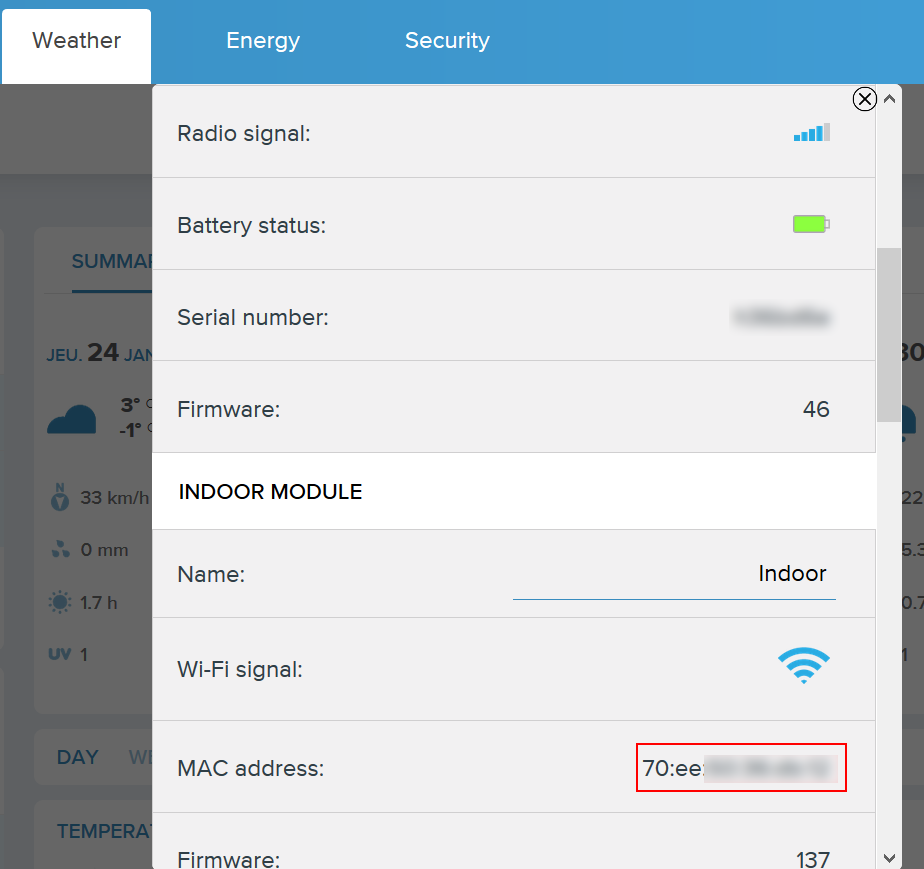

# Netatmo

## Synopsis

This neuron allows to control your netatmo devices.
*Only energy devices are currently supported*

You'll need a netatmo account and developer id to use the module.
See Getting the Netatmo developper id on how to do it.

## Installation

```bash
kalliope install --git-url https://github.com/royto/kalliope_neuron_netatmo.git
```

## CHANGE_MODE

Allows to change thermostat mode (schedule, away or frost guard)

### Options

| parameter   | required | type   | default | choices    | comment                              |
|-------------|----------|--------|---------|------------|--------------------------------------|
| homeId    | YES      | String | None    |            | id of the home      |
| thermMode | YES      | String | None    |  schedule or away or hg | The mode to set |

#### Return Values

No return Yet

| Name    | Description                                                          | Type   | sample        |
|---------|----------------------------------------------------------------------|--------|---------------|

#### Synapses example

``` yml
  - name: "netatmo-therm-away"
    signals:
      - order: "Set thermostat mode to away"
    neurons:
      - netatmo:
          clientId: "XXX"
          clientSecret: "XXX"
          username: "XXX@gmail.com"
          password: "XXX"
          action: "CHANGE_MODE"
          homeId: "XXX"
          thermMode: "away"
          say_template: 
            - "Thermostat set to mode away"
```

## GET_STATUS

Allows to get thermostat status

### Options

| parameter   | required | type   | default | choices    | comment                              |
|-------------|----------|--------|---------|------------|--------------------------------------|
| homeId    | YES      | String | None    |            | id of the home      |

#### Return Values

Home status.

| Name    | Description                                                          | Type   | sample        |
|---------|----------------------------------------------------------------------|--------|---------------|
| rooms | list of rooms | dict of Rooms | |

##### Rooms

| Name    | Description                                                          | Type   | sample        |
|---------|----------------------------------------------------------------------|--------|---------------|
|id|id of the room|Number| 12345|
|name|Name of the room|String| Kitchen |
|reachable|False if none of the module of the room are reachable|Boolean|True|
|currentTemp|Current temperature of the room|float|21
|mode|Current Mode (manual, max, off, schedule, away, hg)|String| Schedule|
|wantedTemp|Wanted temperature in the room|float| 22.5|

#### Synapses example

``` yml
 - name: "netatmo-therm"
    signals:
      - order: "What is the temperature in the house"
    neurons:
      - netatmo:
          clientId: "XXX"
          clientSecret: "XXX"
          username: "XXX@XXX.com"
          password: "XXX"
          action: "GET_STATUS"
          homeId: "XXX"
          file_template: "templates/home_status.j2"
```

The template defined in the templates/home_status.j2

```jinja2

    {{ room['name'] }} is at {{ room['currentTemp'] }} celcius degree.
    Wanted tempetaure is {{ room['wantedTemp'] }}.

```

## SET_TEMP

Allows to change temperature of a rooom

### Options

| parameter   | required | type   | default | choices    | comment                              |
|-------------|----------|--------|---------|------------|--------------------------------------|
| homeId    | YES      | String | None    |            | id of the home      |
| roomId    | YES      | String | None    |            | id of the room      |
| temp     | YES      | float | None    |            | the temperature to set      |

#### Return Values

No value returned.

#### Synapses example

``` yml
  - name: "netatmo-set-temp"
    signals:
      - order: "Set temperature to 20 in the living room"
    neurons:
      - netatmo:
          clientId: "XXX"
          clientSecret: "XXX"
          username: "XXX"
          password: "XXX"
          action: "SET_TEMP"
          homeId: "XXX"
          temp: 20
          say_template: "Temperature changed"
```

## CANCEL_SET_TEMP

Cancel the temperature set for a room and use scheduled temperature.

### Options

| parameter   | required | type   | default | choices    | comment                              |
|-------------|----------|--------|---------|------------|--------------------------------------|
| homeId    | YES      | String | None    |            | id of the home      |
| roomId    | YES      | String | None    |            | id of the room      |

#### Return Values

No value returned.

#### Synapses example

``` yml
  - name: "netatmo-cancel-temp"
    signals:
      - order: "Cancel boost mode in the living room"
    neurons:
      - netatmo:
          clientId: "XXX"
          clientSecret: "XXX"
          username: "XXX"
          password: "XXX"
          action: "CANCEL_SET_TEMP"
          homeId: "XXXX"
          roomId: "XXX"
          say_template: "Boost mode canceled"
```

## SWITCH_SCHEDULE

ALlows to switch the selected scheduled.

### Options

| parameter   | required | type   | default | choices    | comment                              |
|-------------|----------|--------|---------|------------|--------------------------------------|
| homeId    | YES      | String | None    |            | id of the home      |
| scheduleId    | YES      | String | None    |            | id of the schedule      |

#### Return Values

No value returned.

#### Synapses example

``` yml
  - name: "netatmo-switch-schedule"
    signals:
      - order: "Switch to schedule holidays"
    neurons:
      - netatmo:
          clientId: "XXX"
          clientSecret: "XXX"
          username: "XXX"
          password: "XXX"
          action: "SWITCH_SCHEDULE"
          homeId: "XXXX"
          scheduleId: "XXX"
          say_template: "Scheduled changed"
```

## Getting the Netatmo developper id

Connect to the Netatmo connect website https://dev.netatmo.com/myaccount/ and create an app. Save the clientId and clientSecret automatically generated by Netatmo.

## Getting HomeId, roomId, scheduleId for thermostat synapses

First you need to get a token. You need to use the [oauth2](https://dev.netatmo.com/en-US/resources/technical/guides/authentication/clientcredentials) endpoint accessible at https://api.netatmo.com/oauth2/token.

Choose `x-www-form-urlencoded` as Content-type, set `grant-type` to `password`, `scope` to `read_thermostat write_thermostat` (you can add more if needed if you have others netatmo products) and fill `username`, `password`, `client_id` and `client_secret` with your account info.



You get a response in JSON format containing a property `access_token`.



Now you need to call the [HomeData](https://dev.netatmo.com/en-US/resources/technical/reference/energy/homesdata) endpoint to get information about your home data.



Here how to get the needed values to use the energy API

- homeId: `body.homes[homeIndex].id`
- roomId: `body.homes[homeIndex].romms[roomIndex].id`
- homeId: `body.homes[homeIndex].shedules[scheduleIndex].id`

## Getting Weather Station Device id

Go to the weather app on the [netatmo portal](https://my.netatmo.com/app/weather)

Click on the settings button.

Scroll to MAC Address


